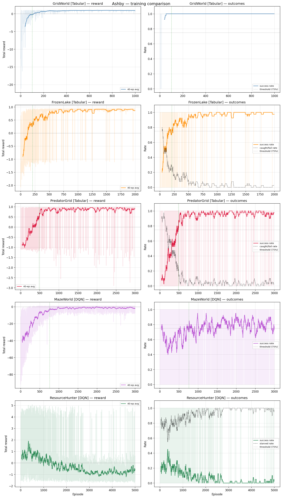
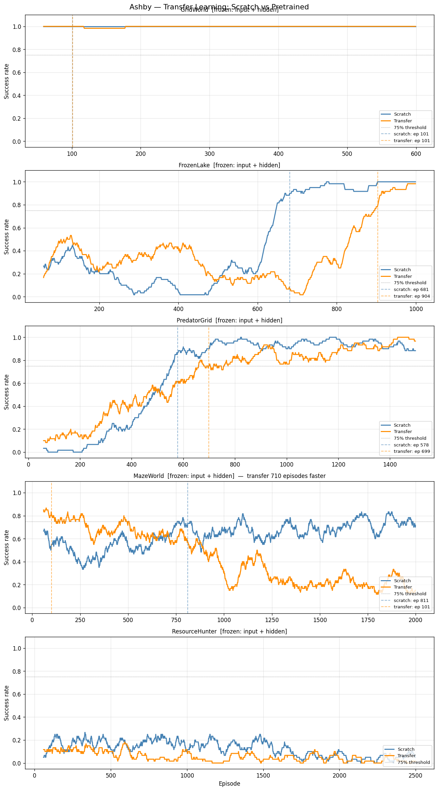

# Ashby


A reinforcement learning agent that learns to navigate five radically different environments — then transfers that knowledge so it learns new ones faster.

Named after [William Ross Ashby](https://en.wikipedia.org/wiki/W._Ross_Ashby) and his homeostatic principle: a system that adapts to maintain viability across changing conditions.

---

## What it does

Five environments, five mechanics, one agent. Ashby trains a DQN whose hidden layer learns generic navigation features — spatial reasoning, threat avoidance, multi-objective planning. Those features transfer: fine-tuning on MazeWorld with frozen base layers converges **8x faster** than training from scratch.

The negative results are just as interesting. Transfer hurts on environments with fixed random maps (FrozenLake, PredatorGrid) because the frozen input layer encodes features for the pretrain instance, not the benchmark instance. That's not a bug — it's an honest finding about when transfer learning works and when it doesn't.

---

## Pipeline

```
  Rust environments (games/)
  ┌──────────────┐  ┌──────────────┐  ┌───────────────┐  ┌──────────────┐  ┌─────────────────┐
  │  GridWorld   │  │  FrozenLake  │  │ PredatorGrid  │  │  MazeWorld   │  │ ResourceHunter  │
  │  5×5, det.   │  │  5×5, stoch. │  │  5×5, advers. │  │  7×7, proc.  │  │  7×7, multi-obj │
  └──────┬───────┘  └──────┬───────┘  └───────┬───────┘  └──────┬───────┘  └────────┬────────┘
         └─────────────────┴─────────────────────┘               └─────────────────────┘
                                        │ PyO3 bridge (bridge/)
                                        ▼
                              Python agents (mind/)
                         ┌────────────────────────────┐
                         │  QLearningAgent  (tabular)  │
                         │  DQNAgent        (neural)   │
                         │  TransferAgent   (transfer) │
                         └─────────────┬──────────────┘
                                       │
                    ┌──────────────────┼──────────────────┐
                    ▼                  ▼                   ▼
             training_results.png  weights/*.pth  transfer_benchmark.png
```

---

## Environments

| Name | Mechanic | State | Agent | Result |
|---|---|---|---|---|
| GridWorld | Reach fixed target, 5×5 grid | 4D (positions) | Tabular Q | 100%, ep 101 |
| FrozenLake | Navigate ice + holes, stochastic slip | 5D (pos + tile type) | Tabular Q | 97%, ep ~391 |
| PredatorGrid | Reach center, evade greedy predator | 6D (agent + target + predator) | Tabular Q | 96%, ep ~484 |
| MazeWorld | New random 7×7 maze every episode | 53D (pos + full grid) | DQN | 91%, ep ~883 |
| ResourceHunter | Collect 5 resources before starving | 18D (pos + hunger + 5 resources) | DQN | converges ~ep 4000 |

All environments share the same interface: `reset() -> State`, `step(action) -> (State, Reward, done)`.



---

## Transfer learning results

Pretrain one agent sequentially on all five environments, then benchmark: scratch vs. fine-tuning with frozen base layers.

| Environment | Scratch | Transfer | Gain |
|---|---|---|---|
| GridWorld | 101 | 101 | 0 |
| FrozenLake | 681 | 904 | -223 |
| PredatorGrid | 578 | 699 | -121 |
| **MazeWorld** | **811** | **101** | **+710** |
| ResourceHunter | >2500 | >2500 | 0 |

**MazeWorld (+710 episodes, 8x speedup)** — this is the cleanest result. Every episode generates a new random maze, so pretrained features are genuinely distribution-general. With input+hidden layers frozen, only the 64→4 output head retrains. That's a trivial optimization problem when the feature extractor is already good.

**FrozenLake and PredatorGrid (-223, -121)** — the frozen input layer learned to encode a specific map instance during pretraining. The benchmark runs on a different random instance. Freezing the wrong encoder is worse than starting fresh. The negative results aren't hidden — they tell you something real about the limits of transfer learning on fixed-instance environments.

**GridWorld (0)** — too simple. 101 episodes is already fast enough that there's nothing to gain.

**ResourceHunter (0)** — needs ~5000 episodes in the full pipeline. Pretrain allocates 4000 and the task is hard enough that neither agent converges in 2500.

See [docs/transfer_learning.md](docs/transfer_learning.md) for the full analysis.



---

## ViZDoom

Beyond simulated environments, Ashby trains on ViZDoom — a real FPS game.
Two scenarios validated, both with visual transfer benchmarks.

| Scenario | Episodes | Result |
|---|---|---|
| basic | 1000 | 100% kill rate |
| defend_the_center | 2000 | 38 kills / 10 episodes |

Transfer basic → defend_the_center: converges **3x faster** than scratch.

```bash
make vizdoom-train        # headless training, generates vizdoom_results.png
make vizdoom-watch        # watch the agent play in a real Doom window
make vizdoom-defend       # train on defend_the_center
make vizdoom-defend-watch # watch defend_the_center agent play
make vizdoom-transfer     # benchmark scratch vs transfer between scenarios
```

---

## Rocket League (RLGym)

Beyond simulated grids and ViZDoom, Ashby also trains on real Rocket League — via [RLGym](https://rlgym.org/)/RocketSim for fast simulated self-play, real ranked replays for behavioral cloning, and RLBot to actually play a real match. Full writeup, including the bugs that shaped the replay parser: [docs/rocket_league.md](docs/rocket_league.md).

```
ballchasing.com replays  →  boxcars_py parser  →  behavioral cloning  →  PPO fine-tuning (rlgym-ppo)  →  RLBot (real game)
   11,259 downloaded          6,000 parsed OK        ImitationNet            self-play, 200M steps         real 1v1 match
                               127.98M frames         18 → 256 → 256 → 8      imitation-seeded policy
```

| Stage | Result |
|---|---|
| Replays downloaded | 11,259 (ballchasing.com, ranked 1v1, diamond-1+) |
| Replays parsed successfully | 6,000 (rest hit an unrecoverable replay-format bug — see docs) |
| Training frames | 127,980,513 |
| Behavioral cloning | ~0.085 MSE final validation loss |
| PPO fine-tuning | 200,000,000 steps, reward climbing to the mid-teens, peaking around +18 |


*Train/val MSE loss for the behavioral-cloning run above (~0.085 final). Single-epoch config means this renders as a single, effectively invisible point rather than a curve — see [docs/rocket_league.md](docs/rocket_league.md#behavioral-cloning) for why.*

**DDPG, then PPO.** RL fine-tuning originally used DDPG, matching this project's other from-scratch agents. DDPG's actor update has no brakes on how far one gradient step can move the policy, so the first update after loading imitation-pretrained weights dragged them toward whatever a still-random critic preferred — undoing the pretraining (catastrophic forgetting). PPO's clipped objective doesn't have that failure mode, so `ppo_train.py` (via [rlgym-ppo](https://github.com/AechPro/rlgym-ppo)) replaced the DDPG pipeline for RL training entirely. Reasoning in full: [docs/architecture.md](docs/architecture.md#rlgym-ppo-instead-of-a-custom-ddpg-agent).


*3,000 episodes of the superseded DDPG self-play run — touch rate and goal differential both stay flat and noisy for the whole run, part of why PPO replaced it.*

**Being honest about where this stands.** The reward curve is a real success. But policy entropy plateaued around 0.50-0.55 and never dropped the way a converging policy's should, and that shows up in real matches: Ashby's play imitates recognizable pieces of Rocket League — approaching the ball, adjusting position — without them reliably chaining into coherent, decisive sequences. An entropy-coefficient and learning-rate decay is implemented and mechanically verified, but whether it actually fixes the plateau hasn't been confirmed by a full run yet. This isn't downplayed relative to the reward number above — both are real, and worth weighing equally.

```bash
make rl-download    # download ranked replays from ballchasing.com (needs BALLCHASING_TOKEN)
make rl-parse       # parse downloaded replays into a behavioral-cloning dataset
make rl-train-bc    # behavioral cloning -> rl_imitation.pth
make rl-train-ppo   # PPO fine-tuning via rlgym-ppo -> mind/weights/ppo/
make rl-watch       # watch the trained policy play 1v1 in RocketSim
make rl-rlbot       # point the RLBot GUI at Ashby for a real Rocket League match
```

---

## Getting started

**Prerequisites:** Rust (stable), Python 3.12, `cargo`. For real-match Rocket League play: [RLBot v2](https://rlbot.org/) and Rocket League itself (only needed for `make rl-rlbot` / `mind/rl/run_match.py` — everything else trains against RocketSim, no game install required).

```bash
git clone <repo>
cd Ashby

# Create .venv and install all Python deps (once)
make setup

# Full transfer learning demo: build → pretrain → benchmark
make run

# Or just the original training pipeline
make train

# Eval table (fast, no plots)
make eval
```

**What you get after `make run`:**
- `mind/weights/` — pretrained checkpoints per environment
- `mind/transfer_benchmark.png` — scratch vs transfer learning curves side by side

**Individual targets:**
```bash
make build      # compile Rust bridge (needed before any Python script)
make pretrain   # sequential pretraining, saves weights
make benchmark  # scratch vs transfer comparison
make train      # original full training pipeline
make eval       # quick evaluation table
make help       # list all targets
```

---

## File structure

```
Ashby/
├── Cargo.toml                  # Rust workspace
├── Makefile                    # all build and training commands
│
├── core/                       # shared Rust types
│   └── src/
│       ├── environment.rs      # Environment trait (the contract all envs fulfill)
│       └── types.rs            # State, Action, Reward type aliases
│
├── games/                      # the five environments (Rust)
│   └── src/
│       ├── grid.rs             # GridWorld — 5×5 deterministic navigation
│       ├── frozen_lake.rs      # FrozenLake — stochastic ice, fixed holes
│       ├── predator_grid.rs    # PredatorGrid — adversarial greedy predator
│       ├── maze_world.rs       # MazeWorld — procedural maze, new layout every ep
│       └── resource_hunter.rs  # ResourceHunter — multi-objective under time pressure
│
├── bridge/                     # PyO3 layer
│   └── src/lib.rs              # exposes all envs to Python via maturin
│
├── mind/                       # Python — agents and training
│   ├── agent.py                # QLearningAgent — tabular Q-Learning
│   ├── dqn_agent.py            # DQNAgent — Deep Q-Network with target network
│   ├── transfer_agent.py       # TransferAgent — save/load/freeze for transfer
│   ├── memory.py               # ReplayBuffer — experience replay
│   ├── train.py                # full training pipeline, generates training_results.png
│   ├── eval.py                 # evaluation table across all environments
│   ├── pretrain.py             # sequential pretraining, saves mind/weights/*.pth
│   ├── benchmark.py            # scratch vs transfer benchmark, generates transfer_benchmark.png
│   ├── weights/                # pretrained checkpoints (created by make pretrain)
│   │   ├── gridworld.pth
│   │   ├── frozen_lake.pth
│   │   ├── predator_grid.pth
│   │   ├── maze_world.pth
│   │   ├── resource_hunter.pth
│   │   ├── rl_imitation.pth    # behavioral-cloning weights (imitation.py)
│   │   ├── rl_policy.pth       # DDPG weights, superseded by ppo/ (kept as a fallback)
│   │   └── ppo/                # rlgym-ppo checkpoints, one numbered folder per save
│   │
│   └── rl/                     # Rocket League — see docs/rocket_league.md
│       ├── env.py                 # AshbyObsBuilder, AshbyReward, make_env() -- shared by every script below
│       ├── download_replays.py    # ballchasing.com replay downloader
│       ├── parse_replays.py       # boxcars_py -> dataset_replays.pkl
│       ├── dataset.py             # dataset_replays.pkl / session_*.pkl -> DataLoaders
│       ├── imitation.py           # behavioral cloning -> rl_imitation.pth
│       ├── rl_agent.py            # DDPG actor-critic (superseded by ppo_train.py)
│       ├── rl_train.py            # DDPG training loop (superseded by ppo_train.py)
│       ├── ppo_train.py           # PPO fine-tuning via rlgym-ppo -> mind/weights/ppo/
│       ├── record.py              # play 1v1 vs Ashby with a gamepad, log (state, action) pairs
│       ├── watch.py                # watch the trained RocketSim policy play 1v1
│       ├── rlbot.toml              # RLBot v2 bot config, points at rlbot_agent.py
│       ├── rlbot_agent.py         # RLBot v2 wrapper -- Ashby in a real Rocket League match
│       └── run_match.py           # automated you-vs-Ashby match via RLBot, live stats
│
└── docs/
    ├── environments.md         # per-environment design decisions and mechanics
    ├── transfer_learning.md    # how transfer works here, why the results look like they do
    ├── architecture.md         # Rust trait, PyO3 bridge, DQN, TransferAgent, rlgym-ppo internals
    ├── results.md              # all plots, tables, and what the curves tell you
    └── rocket_league.md        # replay pipeline, behavioral cloning, DDPG->PPO, RLBot
```

---

## References

- W. Ross Ashby, *Design for a Brain* (1952) — homeostasis, adaptive behavior, essential variables
- R. Bellman, *Dynamic Programming* (1957) — the Bellman equation underlying Q-learning
- V. Mnih et al., *Human-level control through deep reinforcement learning* (2015, Nature) — DQN, target network, experience replay
- A. Lazaric, *Transfer in Reinforcement Learning: a Framework and a Survey* (2012) — when and why transfer works in RL
