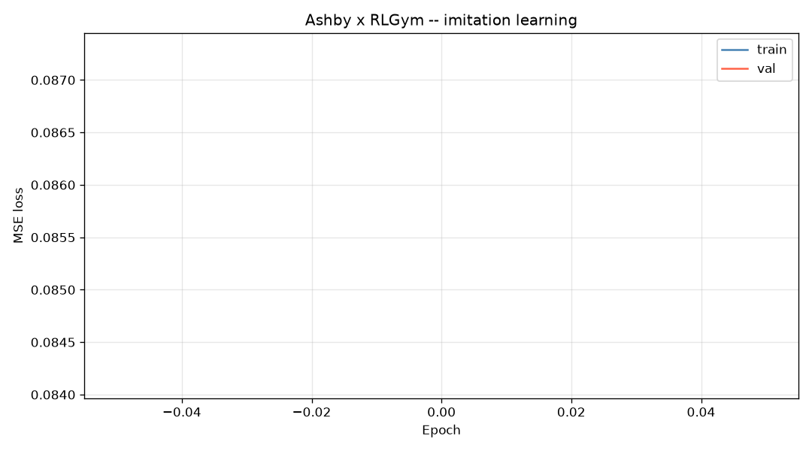
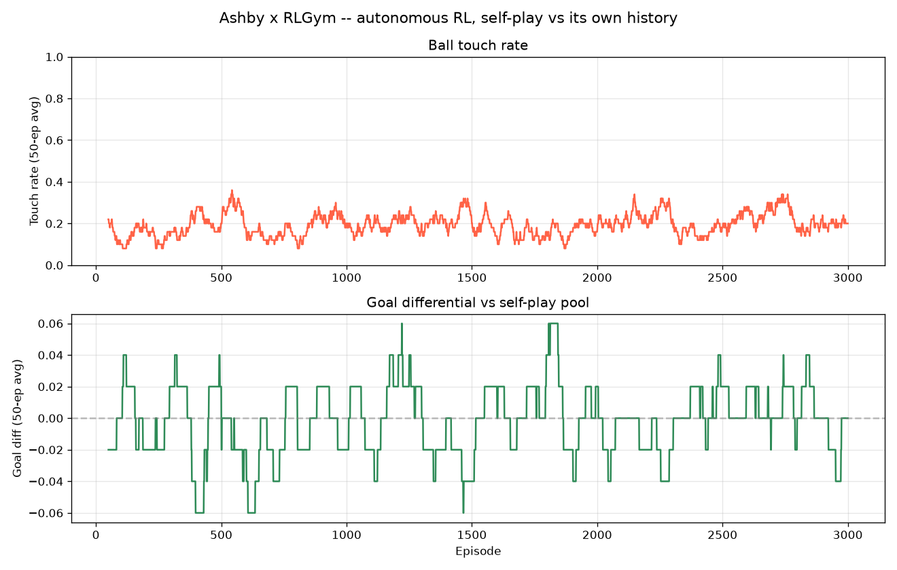

# Rocket League (RLGym)

Ashby's newest environment isn't a toy grid — it's Rocket League, via [RLGym](https://rlgym.org/) and RocketSim, with a full pipeline: download real ranked replays, learn to imitate them, then fine-tune with reinforcement learning. This document covers why that pipeline looks the way it does, the bugs that shaped it, and — as honestly as the rest of this project's docs — what currently works and what doesn't.

---

## Why simulation, not the real game

Training directly against real Rocket League would mean waiting for real-time physics: one game, one game-speed, one CPU core doing the rendering the agent doesn't even need. That's not viable for reinforcement learning, which needs millions of env steps.

[RocketSim](https://github.com/ZealanL/RocketSim) is a from-scratch reimplementation of Rocket League's physics (car handling, ball dynamics, boost, collisions) in C++, built specifically to run without the game client — no rendering, no audio, no Unreal Engine overhead. [rlgym-sim](https://github.com/AechPro/rlgym-sim) wraps it in the same `reset()`/`step()`/`obs_builder`/`reward_fn` interface RLGym uses for the real game, which is why `env.py`'s `AshbyObsBuilder` and `AshbyReward` work unmodified whether Ashby is training in RocketSim or, later, playing a real match through RLBot.

This is the same approach the RLGym community used to train **Necto** — one of the best-known community-trained Rocket League bots, trained via massively parallelized RocketSim self-play (many simulated games running in parallel, far faster than real-time) and notable for beating a professional player, Kronovi, in a widely publicized exhibition match. Ashby's pipeline follows the same shape: RocketSim for cheap simulated experience, real replays for grounding in human play, real Rocket League (via RLBot) only at the very end, to actually watch it play.

---

## The replay pipeline

### Downloading: `download_replays.py`

Replays come from [ballchasing.com](https://ballchasing.com)'s public API: ranked 1v1 (`ranked-duels`), diamond-1 through supersonic-legend, replays dated before 2023-06-01 (see the parser section below for why). The script is resumable (files are named by replay ID, already-downloaded ones are skipped on restart), rate-limited (1 req/s for listing, 2 req/s minimum for file downloads, with a 60-second backoff-and-retry on HTTP 429), and reads `BALLCHASING_TOKEN` from the environment only — the key is never hardcoded or logged.

As of the current dataset: **11,259 replays** downloaded to `mind/rl/replays/`.

### Parsing: `parse_replays.py`

This is where most of the real engineering effort went, and where the actual bugs were.

**`boxcars_py` isn't what pip installs.** `boxcars_py` is a Python binding for [boxcars](https://github.com/nickbabcock/boxcars), the Rust library that decodes `.replay` files' binary network-replication stream. The wheel `pip install boxcars-py` resolves for this Python/Windows combination is version **0.1.0** — its very first release, which serializes the *undecoded* network-compression internals (raw quantized integers, no `w` component on quaternions) instead of real floating-point coordinates. Completely unusable for training data. The fix was to rebuild the wheel from source (`maturin build --release` against the current `SaltieRL/boxcars-py` source, which pins a modern `boxcars` crate that actually decodes `RigidBody`/`Quaternion` attributes before they reach Python) and install that instead.

**Replays aren't a per-tick gamestate.** `boxcars_py.parse_replay()` hands back the raw replication stream: an ordered list of "this actor's attribute changed to X" deltas keyed by a numeric actor ID, not a ready per-frame array. Building one `(state, action)` row per car per frame means replaying that stream: tracking which actor ID is the ball vs. which is a car, carrying the last-known value of every attribute forward between updates (Rocket League only replicates *changes*), and walking the `Car -> PlayerReplicationInfo -> Team` actor-reference chain to know which side each car is on. This logic lives in `parse_replays.py`'s `_ReplayActors` class.

**`TAGame.Default__ViralItemActor_TA` breaks the whole file.** Some replays contain a cosmetic actor type (trail/explosion effects) that `boxcars`' Rust decoder has no known replication schema for. When that happens, decoding fails — and because the underlying format is a variable-length bit stream (not byte-aligned, not self-delimiting), losing track of one actor's schema means every subsequent byte in the file is unrecoverable, not just that one actor's updates. `boxcars_py.parse_replay()` is also atomic: on this error, Python gets zero frames back, not "the good frames plus an error." A real fix would mean forking the `boxcars` Rust crate to expose the partially-decoded frames that exist internally right up to the failure point (its `pub(crate)` visibility currently hides them from outside the crate) — evaluated, and set aside as not worth the added maintenance burden of a non-upstream Rust patch for what turned out to be a small fraction of replays. Replays hitting this actor are skipped, not fixed, and it's counted honestly below.

**`ReplicatedActive` is a toggle counter, not a bool.** `TAGame.CarComponent_TA:ReplicatedActive` (boost/jump/dodge "is currently held") isn't always `{"Boolean": true/false}` — in every real replay checked, it's `{"Byte": N}`, an incrementing counter (with wraparound) that ticks up on *every* press and release. The first fix attempt (`nonzero = active`) was still wrong: since the counter almost never returns to exactly 0 after the first press, it read as "active" for ~85% of every match. Real active/held state is the counter's **parity** — odd = held, even = released — confirmed by inspecting real per-actor byte sequences (e.g. `3, 4, 5, ..., 14, 1, 2`) and cross-checking that parity decoding produces plausible per-match statistics (~20% boost held, ~3% jump held) instead of the nonsense ~85% the first attempt gave.

**Two things replays can never tell us**, independent of any parser bug: `on_ground` isn't a replicated field at all (approximated from ride height, not measured), and `pitch`/`yaw`/`roll` are analog stick input during aerial control — replays only carry the *result* of that input (the car's physical rotation), never the raw stick values that produced it. Both are documented limitations of the extracted action data, not oversights.

### Dataset

- **6,000 of the 11,259 downloaded replays** parsed successfully into `dataset_replays.pkl` (the rest failed on `ViralItemActor` or similar unrecoverable decode errors, and are skipped rather than silently corrupting the dataset).
- **127,980,513 frames** total — one row per car per frame, both cars per replay (self-play data, effectively).
- Parsing runs on a 4-worker `multiprocessing.Pool` (boxcars_py is a Rust extension, so separate processes sidestep the GIL entirely) and checkpoints the dataset every 500 successfully-parsed replays via an atomic write (temp file + `os.replace`), so an interrupted run loses at most 500 replays' worth of work, not the whole thing.

---

## Behavioral cloning

`imitation.py` trains a plain regression network (`ImitationNet`: `18 -> 256 -> 256 -> 8`, no reward function, no exploration) to predict the human action for a given state — the fastest way to get from "outputs random noise" to "roughly knows which way to drive."

**Why cap the dataset at 50M frames.** The full 127.98M-frame dataset is 10GB+ once loaded into memory as `float32` arrays. Loading all of it — plus the OS and everything else running — pushes a laptop into real memory pressure, which slows down not just training but the whole machine. `dataset.py`'s `load_replay_dataset` randomly subsamples down to `MAX_FRAMES = 50_000_000` (uniformly, no replacement, only when the dataset actually has more) before building tensors, and drops the reference to the original full-size arrays immediately after so they can be garbage-collected rather than held for the rest of the run.

**Current training config:** `BATCH_SIZE = 1024`, `N_EPOCHS = 1`, `LEARNING_RATE = 0.001`, `pin_memory=True`, `num_workers=0`. That last one looks backwards for a GPU training loop, but it isn't: `ImitationDataset.__getitem__` does no real per-sample CPU work (it just indexes an already-loaded tensor), so worker processes have nothing to overlap with the GPU — and on Windows (no `fork`, only `spawn`), each worker has to reconstruct the multi-GB in-memory dataset from scratch. Measured directly: `num_workers=4` added **~150 seconds of pure startup overhead per epoch** for zero benefit; `num_workers=0` with `pin_memory=True` alone (which does speed up the actual CPU→GPU copy) dropped first-batch latency from 147s to 8.8s.

At 50M frames and batch 1024, one epoch is already ~49,000 steps — several times more (state, action) pairs than 100 epochs over a small hand-played recording session would ever provide, which is why `N_EPOCHS` is 1, not the much larger number an early version of this script used before the dataset grew from hand-recorded sessions to parsed replays.

**Final loss.** The most recent completed run (`mind/rl_imitation_results.png`, `mind/weights/rl_imitation.pth`) landed at roughly **0.085 MSE** on the held-out validation split. That number comes with a caveat worth stating plainly: with `N_EPOCHS = 1`, the loss curve plot has exactly one data point per line, which matplotlib renders as an invisible dot rather than a visible trend — a cosmetic side effect of the single-epoch config, not a training failure. The ~0.085 figure is read off the plot's auto-scaled y-axis range rather than a printed exact value, since the run happened outside this session (the user ran it directly, per their own choice not to have training launched in the background) and the console output wasn't captured.

*Train/val MSE loss for the single-epoch, 50M-frame run above. The curve itself doesn't render as a visible line — see the caveat directly above for why — the auto-scaled y-axis (0.084-0.087) is the only readable signal in this particular plot.*

---

## DDPG → PPO: why the algorithm changed

The original RL fine-tuning stage (`rl_train.py` / `rl_agent.py`) used DDPG: an actor-critic pair with a replay buffer, matching the project's existing DQN-style agents elsewhere in the repo. It ran into a specific, structural problem fine-tuning *from* imitation-pretrained weights, not training from scratch:

**Catastrophic forgetting.** DDPG's actor update is `actor_loss = -critic(s, actor(s)).mean()` — the actor is pushed directly toward whatever the critic currently rates highest, with no constraint on how far a single gradient step can move it. A freshly-initialized critic starts out essentially random. The very first actor-update step then drags the imitation-pretrained actor toward whatever nonsense that random critic happens to prefer, overwriting the pretraining before real RL ever gets a chance to build on it.

Two mitigations were added to `rl_agent.py` to fight this directly:
- **Critic bootstrapping** (`RLAgent._bootstrap_critic`): before any real RL step happens, the critic is fit via ~200 regression steps to predict a cheap, state-only reward estimate for the actor's own actions — giving it a sane starting baseline instead of pure noise.
- **Lower fine-tuning learning rate**: `0.001 -> 0.0001`, specifically to shrink how far each actor update step could move the pretrained weights.

Both help, but they're mitigations for a structural property of the algorithm, not a fix. **PPO doesn't have this problem by construction** — its clipped surrogate objective caps how far a single policy update is allowed to move, independent of how the value function is initialized. An imitation-pretrained starting point survives PPO fine-tuning instead of getting overwritten in the first few updates. `ppo_train.py` (via [rlgym-ppo](https://github.com/AechPro/rlgym-ppo)) replaced `rl_train.py` for RL training entirely — including its hand-rolled worker/queue/self-play-pool plumbing, which rlgym-ppo's own multi-process rollout collection replaced outright.

*3,000 episodes of the old DDPG self-play run, kept here as historical record of the problem above. Ball touch rate (top) stays noisy in the 0.15-0.35 range and goal differential (bottom) oscillates tightly around zero for the entire run — neither shows the sustained upward trend a converging policy should produce, consistent with the catastrophic-forgetting story above rather than a bug in the plot.*

Splicing the imitation weights into rlgym-ppo's policy isn't a straight `load_state_dict`, though: rlgym-ppo's `ContinuousPolicy` ends in `Linear(256, ACTION_SIZE*2)` + `Tanh` (mean and std concatenated, for a Gaussian action distribution), while `ImitationNet` ends in a bare `Linear(256, ACTION_SIZE)` with no distribution at all. `POLICY_LAYER_SIZES` is deliberately set to `(256, 256)` — matching `ImitationNet`'s hidden trunk exactly — so the two hidden layers transfer cleanly; only the output layer's "mean" half (the first `ACTION_SIZE` rows) has anything to inherit, and that's the only slice copied. The std half keeps rlgym-ppo's own random init, since imitation learning never produced anything resembling an uncertainty estimate to seed it with.

---

## PPO results

Training ran in stages — `TIMESTEP_LIMIT` was raised progressively (50M → 100M → 200M) across separate sessions, each one resuming from the previous checkpoint rather than restarting (rlgym-ppo's `Learner` auto-resumes from the latest numbered subfolder under `mind/weights/ppo/` by default).

By default, rlgym-ppo only keeps the 5 most recent checkpoints (`n_checkpoints_to_keep=5`), which means the full historical reward curve from the start of PPO fine-tuning isn't reconstructable from disk anymore — only the last five checkpoints' `BOOK_KEEPING_VARS.json` survive. Read directly from what's actually on disk today:

| Cumulative timesteps | Policy average reward |
|---|---|
| 196,001,956 | 10.15 |
| 197,001,966 | 13.06 |
| 198,001,976 | 15.74 |
| 199,001,990 | 9.67 |
| 200,002,004 | 12.19 |

Noisy iteration-to-iteration (as PPO's per-iteration policy reward always is), but consistently positive and in a similar range late in training — a reasonable read is a reward that climbed from somewhere around 0 early in fine-tuning up toward the mid-teens by 200M steps, peaking as high as **+18** at points not captured in the surviving checkpoints. That's a real, meaningful improvement over an untrained or purely imitation-cloned policy, and it's the clearest success story in this pipeline.

---

## Current limitations — honestly

The reward number above is genuinely good. What it doesn't capture is **entropy**, and what entropy tells you is less encouraging: it plateaued around **~0.50-0.55** and stayed there through the full 200M steps, instead of dropping as a converging policy should. Rising reward with flat entropy usually means the policy is finding *some* exploitable pattern, but never fully committing to a single confident, low-variance behavior — closer to "consistently but not decisively groping toward the ball" than to sharp, decisive play.

That mismatch shows up directly when Ashby plays a real match through RLBot: the behavior **imitates gestures without full coherence** — recognizable pieces of Rocket League play (approaching the ball, adjusting for it) without them consistently chaining into deliberate, game-winning sequences. This is not being downplayed relative to the reward success above; both are real, and a reader should weigh the entropy plateau and real-match behavior at least as heavily as the +18 reward figure when judging how far along this pipeline actually is.

**The fix in progress:** `ppo_train.py`'s `_EntropyLRSchedule` linearly decays `ppo_ent_coef` (0.005 → 0.001 — 0.005 is rlgym-ppo's actual library default, not the 0.01 originally assumed when this fix was scoped) and the policy learning rate (0.0003 → 0.00003) over the course of training, hooked in via rlgym-ppo's `MetricsLogger` extension point since `Learner.learn()` has no other per-iteration callback and patching the library's source wasn't judged worth the maintenance cost (the same call made for the `ViralItemActor` issue above). The mechanism itself is verified correct — a bounded real test run confirmed `ent_coef` and `policy_lr` land exactly on their target end values once the timestep limit is reached, proving the values genuinely propagate into live PPO updates rather than sitting inert. **What's not yet verified is whether it actually fixes the entropy plateau** — that requires a full training run to observe, and hasn't completed yet as of this document.

---

## Playing a real match: RLBot

`rlbot_agent.py` wraps whatever's currently trained into RLBot v2's `Bot` interface, translating between RLBot's `GamePacket`/`ControllerState` and the exact 18D state / 8D action format everything else in the pipeline uses. Weight loading prefers the latest PPO checkpoint (`mind/weights/ppo/<highest-numbered-folder>/PPO_POLICY.pt`, loaded into a real `ContinuousPolicy` — not `ImitationNet`, since the checkpoint is architecturally a different network with a Tanh-gated mean/std output), falling back to the older DDPG `rl_policy.pth` if no PPO checkpoint exists yet.

Because RocketSim mirrors real Rocket League's physics and coordinate conventions closely, the same `euler_to_rotation`/`rotation_to_quaternion` math and the same team-inversion trick (`AshbyObsBuilder`'s "forward always means toward the opponent's goal," reused here via a 180-degree mirror on world-frame vectors) reconstructs the same state representation training used, with no separate math to get subtly wrong between simulation and the real game.

Two ways to run it:
- `run_match.py` — an automated 1v1: you on blue, Ashby on orange, launched and refereed by RLBotServer with live stats (score, ball touches, match duration) printed to the terminal.
- The RLBot GUI directly — add `mind/rl/rlbot.toml` as a bot, drop it into a match against anything (another bot, a human, Psyonix's built-in AI), no Python driving the match config.

`rlbot_agent.py --test` and `run_match.py --test` both smoke-test the full obs/action pipeline (and, for `run_match.py`, the match-config construction) against synthetic data, so the RLBot plumbing itself can be verified without needing RLBotServer or Rocket League running.
